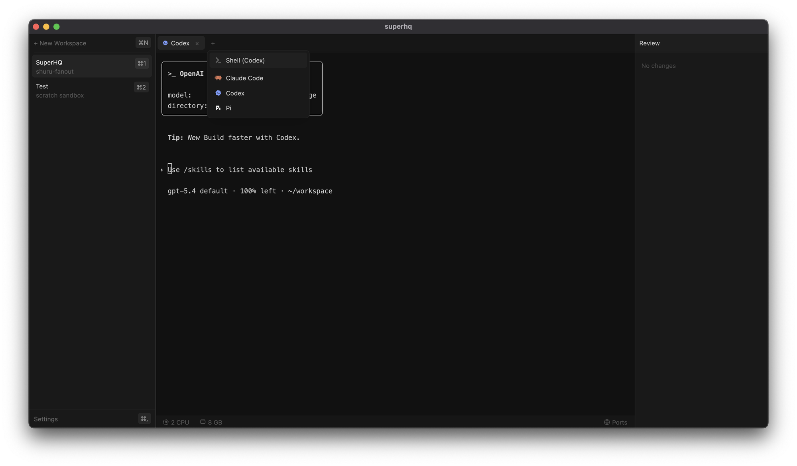

# SuperHQ

A sandboxed AI agent orchestration platform built with Rust and [GPUI](https://gpui.rs). Run multiple AI coding agents (Claude Code, Codex, etc.) in isolated sandbox environments with full terminal access.



## Install

Download the latest `.dmg` from the [Releases](https://github.com/superhq-ai/superhq/releases) page.

> **macOS Gatekeeper:** Since the app is not notarized, macOS will block it on first launch.
> Open **System Settings > Privacy & Security**, scroll down, and click **"Open Anyway"** next to the SuperHQ message.

### Requirements

- macOS 14+ (Apple Silicon)
- ~500 MB disk space for the Shuru runtime (downloaded on first launch)

## Features

- **Sandboxed workspaces** — each workspace runs in an isolated VM with its own filesystem, networking, and resource limits
- **Multiple agents** — run Claude Code, OpenAI Codex, and custom agents side-by-side
- **Port management** — forward sandbox ports to host, expose host ports to sandboxes
- **Review panel** — see file changes made by agents with unified diff view
- **Keyboard-first navigation** — fast workspace/tab switching with shortcuts

## Keyboard Shortcuts

| Action | Shortcut |
|--------|----------|
| New workspace | `Cmd+N` |
| Switch workspace 1-9 | `Cmd+1` - `Cmd+9` |
| New agent tab | `Cmd+T` |
| Close tab | `Cmd+W` |
| Next tab | `Cmd+Shift+]` |
| Previous tab | `Cmd+Shift+[` |
| Switch tab 1-9 | `Ctrl+1` - `Ctrl+9` |
| Settings | `Cmd+,` |

Hold `Cmd` to see workspace shortcut badges. Hold `Ctrl` to see tab badges.

## Building from source

Requires the [shuru SDK](https://github.com/superhq-ai/shuru) cloned as a sibling directory:

```sh
git clone https://github.com/superhq-ai/shuru.git ../shuru
cargo build --release
```

### Package as macOS app

```sh
./scripts/package.sh
# Output: target/SuperHQ-<version>.dmg
```

## Architecture

- **GPUI** — GPU-accelerated UI framework (from Zed editor)
- **shuru-sdk** — sandboxed VM orchestration (boot, exec, filesystem, networking)
- **SQLite** — workspace config, secrets (AES-256-GCM encrypted), port mappings
- **Auth gateway** — reverse proxy that injects API credentials without exposing them to sandboxes

## License

[Universal Permissive License v1.0](LICENSE)
